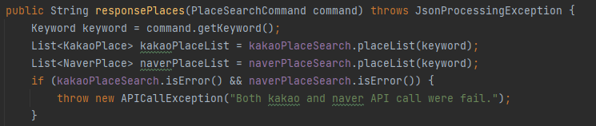
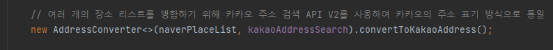
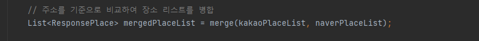
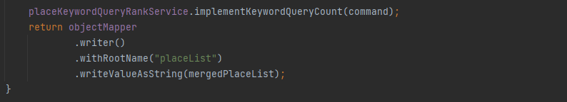

## 사용 기술
- `SpringBoot`  
  : 생산성 향상을 위해 웹 애플리케이션 프레임워크를 사용
- `Spring Data JPA`    
  : 데이터 중심이 아닌 도메인 객체 중심의 코드 작성을 위함
- `Spring Cloud OpenFeign`   
  : HTTP API 통신 시 보일러 플레이트 코드를 줄이고 생산성을 높이기 위함
- `H2`  
  : 데이터의 영속성을 보장하기 위함 (embedded 모드 적용)
- `카카오, 네이버 Open API`  
  : 장소 키워드 검색 및 주소 검색 기능을 제공 받기 위함

---

## cURL 로컬 테스트 방법
> - 장소 키워드 검색 API (테스트 키워드: 곱창, URL 인코딩)
>   + curl -X GET http://localhost:8080/v1/place?keyword=%ea%b3%b1%ec%b0%bd  
> - 장소 키워드 검색 횟수 TOP 10
>   + curl -X GET http://localhost:8080/v1/place/rank

---
## 동시성 이슈에 대한 고려
- 검색 횟수를 카운트 하는 메서드에 synchronized 키워드 적용 
  + 서로 다른 스레드에서 메서드에 동시 접근할 수 없도록 동기화
  + 동기화로 인한 성능 이슈가 생기지 않도록 synchronized 적용 영역 최소화

## 검색 API 제공자의 장애 발생 상황에 대한 고려
- 카카오, 네이버 모두 API 호출 실패 시 에러를 응답
- 한 쪽만 실패할 경우는 로그만 남기고 정상 로직 수행

## 새로운 검색 API 제공자 추가 용이성에 대한 고려
- `Place 객체 다형성 적용`(KakaoPlace, NaverPlace)
  + Place 추상 클래스를 상속 받는 클래스들은 toResponsePlace를 구현해야 하는데, 이 때 provider 정보를 추가
- 변경에 유연한 대처를 위해 응답으로 보내는 ResponsePlace Json 객체를 따로 생성함
- `PlaceListMergeEngine 클래스에 Generic 적용`
  + 새로운 API 제공자 추가 시 쉽게 로직을 추가할 수 있음
  + **API 제공자 추가시 코드 작성 요령 (PlaceList: A,B,C)**
    1. API 제공자에 대한 FeignClient 및 Config 추가
    2. Place 추상 클래스를 상속받는 클래스 추가
    3. PlaceSearch 인터페이스를 구현하는 클래스 추가   
       (placeList 메서드 내부에서 예외 처리 필요)
    4. PlaceSearchService.responsePlaces 메서드 코드 수정   
      **[리스트 병합 코드 설명]**
       1. PlaceList를 받아오고, 예외 발생을 체크
       
       2. 받아온 PlaceList의 주소를 카카오의 주소 표기 방식으로 변경
       
       3. 리스트를 병합
       
       - 새로운 API 제공자를 추가할 경우 한번 더 merge 필요
          1. merge(A, B) → D
          2. merge(D, C) → E  
          **A,B,C 병합 결과는 E가 됨**
       4. 키워드 검색 횟수 카운트 후 Json 형식으로 반환
       

## 오류 및 장애 처리에 대한 고려
- @ControllerAdvice을 사용하여 컨트롤러가 던지는 예외들을 잡아서 처리하도록 구현
- 에러 발생 시 로그를 출력
- 장애 발생 시 원인 추적을 돕는 로그를 남김

## 지속적 유지 보수 및 확장에 용이한 아키텍처에 대한 설계
- `헥사고날 아키텍처(port and adapter 아키텍처)`를 적용
  * 패키지 구조를 크게 Port, Adapter, Application, Domain 으로 나눔
    + Port(`웹/영속성 계층 사이의 인터페이스`)
      * UseCase, Repository, REST API 통신 인터페이스 등이 있음, 의존성 역전을 위해 존재
    + Adapter(`Port의 구현체`)
      * 컨트롤러 및 라이브러리 등이 있음
    + Application(`UseCase의 구현체`)
      * UseCase 인터페이스의 하위 계층이면서 도메인 계층의 상위 계층, 외부와 통신 및 비즈니스 로직을 조합하기 위해 존채
    + Domain(`도메인 객체`)
      * 애플리케이션 계층에서 의존하고 있는 도메인 객체들이 있음
  * 위 패키지 구조를 기반으로 책임을 분리하고 의존성 관리를 철저히 하면 지속적 유지 보수에 도움이 됩니다.  
  * 버그가 발견되었거나 우려되는 부분에 대해 테스트를 지속적으로 보충하고 자동화된 테스트를 바탕으로 지속적으로 유지보수하는 것이 중요합니다.   

---

## 개선이 필요한 부분
- 높은 트래픽과 예상치 못한 장애에 대비하기 위한 캐싱 기술 적용이 필요
- 장애 발생 시 원인 추적을 위한 로그를 충분히 남겨야 함
- 로그를 일정 기간 저장해야 함
- Title, Address, Provider 등 값 객체 정의 및 적용
- 예외 처리 등 다양한 테스트 추가
